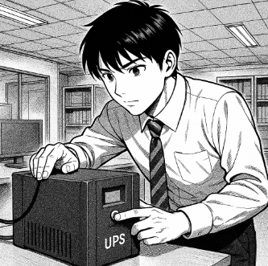

# Descripció de la tasca
## Enunciat
L’empresa TecnoGestió S.L., dedicada a la gestió documental i assessorament informàtic, té un petit despatx amb 4 ordinadors de sobretaula, una impressora-fotocopiadora multifunció (similar a les que té l’escola) i un router d’accés a Internet. Davant les constants incidències amb el subministrament elèctric a la zona, la direcció ha decidit adquirir un SAI per garantir la continuïtat del servei i protegir els equips.

<!--  -->

 

## Solució
Pots veure la solució aquí: [solucio.md](solucio.md)  
📍 [Tornar a la pàgina del projecte](solucio.md)
