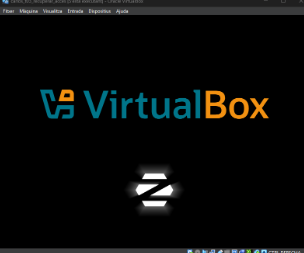
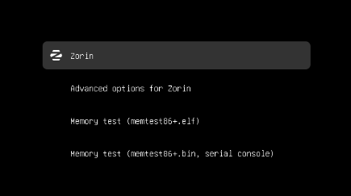
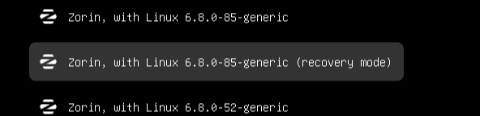
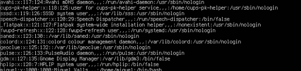
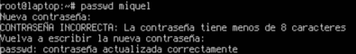
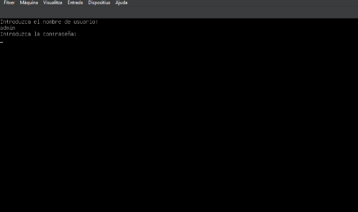
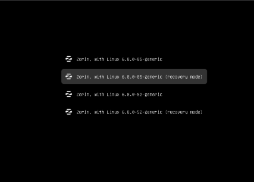

# Solució

Un cop ja tgenim la màquina creada, haurem d’iniciarla.

Quan estiguem en aqeusta pantalla haurem mantendre pulsades les tecles:

**‘Shift + Una Lletre’**

 

Seguidament ens hauria d’aparèixer una pantalla com la següent:

 

Ara entrarem a Advanced Options for Zorin y seguidament a Zorin, with Linux 6.8.0-85-generic (recovery mode)

 

Quan ens carregui el menu de recuperació, haurem de seleccionar l’opció “root”. Y pulsar Enter, quan aparegui aquest text haurem de pulsar Enter de nou per confirmar que volem continuar.

 

El sistema d’arxius principalment està muntat simplement en “Lectura”, per això haurem d’executar la següent comanda per habilitar l’escritura.

> mount -rw -o remount /

Ara per poder crear una nova contrasenya a l'usuari que vulguem haurem de saber el seu nom, per veure’l farem:

> cat /etc/passwd

Amb això obtindrem un gran llistat amb usuaris

 

En el nostre cas hem de crear una nova contrasenya per l’usuari que es pot veure a l’ultima línea: Miquel Valls amb el nom d’usuari: miquel.

Doncs seguidament haurem de executar la comanda:

> passwd miquel

Y ens demana una nova contrasenya, haurem d'introduir-ne una, amb cuidado ja que no la podem visualitzar, seguidament ens la demanara de nou per confirmar-la.

 

Ara el client ens demana que protegim el GRUB, ja que ha vist que cambiar la contrasenya és massa fàcil i vol protegir el sistema.

Per començar generarem una contrasenya xifrada, per fer-ho executarem la comanda:

> sudo grub-mkpasswd-pbkdf2

Ens demana introduir una contrasenya per xifrar-la i seguidament ens la donara xifrada.

> sudo grub-mkpasswd-pbkdf2

 

Ara haurem de obrir el arxiu de configuracions de GRUB amb la comanda

> sudo nano /etc/grub.d/40_custom

I afegim aquestes líneas al final del arxiu:

> set superusers="admin"
> password_pbkdf2 admin grub.pbkdf2.sha512.10000.F1D420317F1DF2F09FBFC84C1DA1C42059A6EFBE16F43A26668DB1E791F887B635CD77772CFF603C07D2AEF84CC2690F113E3E9FC4E441
E315E0554704438982.DE5DC43123EED1BB5FA5874AF328DC876EFC5A5649AF91370D7443CCD05CFB966FE596B4584B534AAA8199A4F024301DD4456EC8EF0906FE370BD5A65CC7C2A9

Ara refresquem/actualitzem grub amb

> sudo update-grub

Si ho hem fet bé ara podrem accedir posant la nostra contraseña 1234.

 
 

🔙 [Tornar a la tasca](README.md)  
📍 [Tornar a la pàgina del projecte](../README.md)
