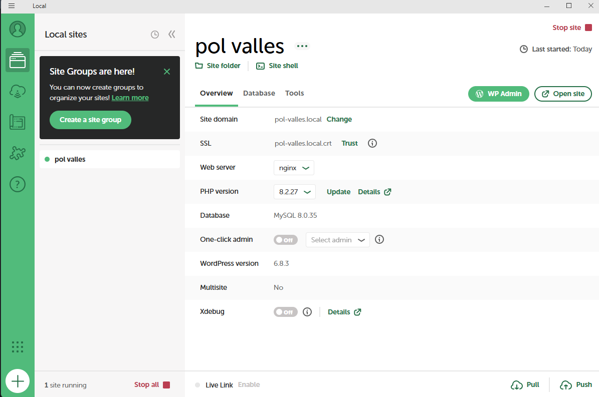
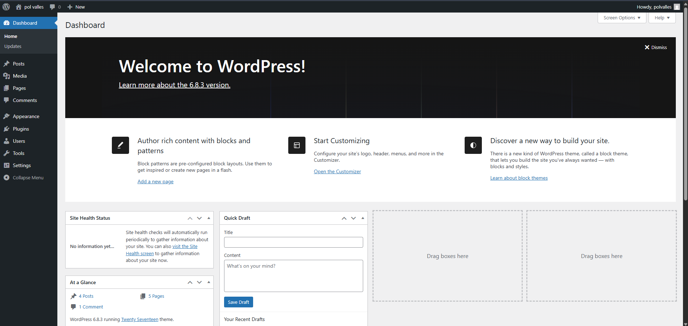
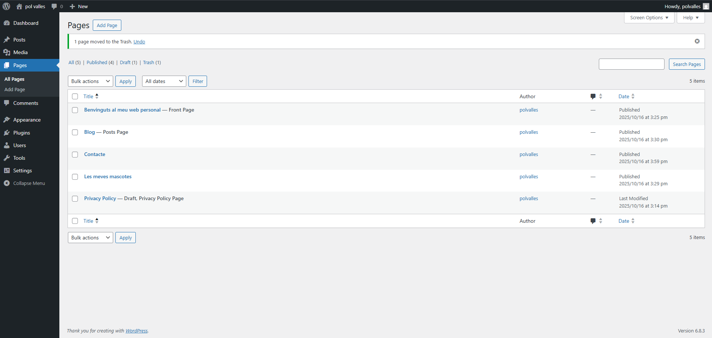
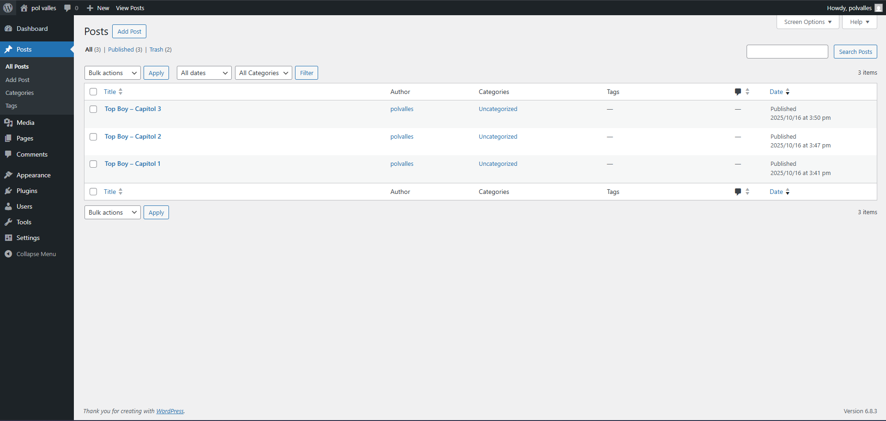
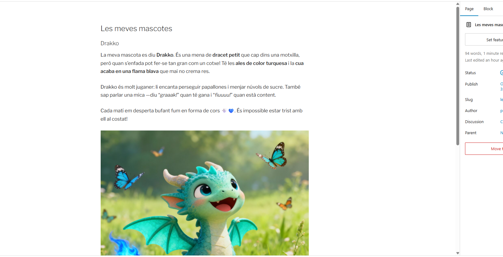
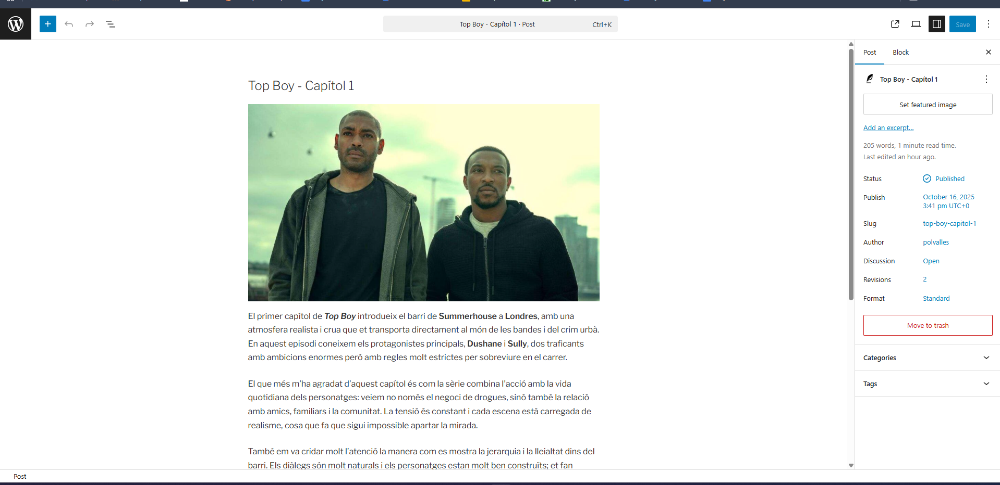

# Tasca 11 Instal·lació de WordPress amb WP Local

**🔗 Pagina web creada:** Pol Valles _(pol-valles.local)_

## 🤳 Imatges relacionades amb la creació d'una web amb WordPress

- 📲 Dashboard de Local WP, per hostejar la web amb WP de forma local

---
- 🛜 Pàgina d'inici (dashboard) de WordPress

---
- 📰 Veure i crear noves pàgines

---
- 📍 Veure i crear noves entrades

---
- 🐕 Pàgina creada sobre mascotes

---
- 🎥 Entrada creada sobre un capítul d'una serie

---
### 🧩 Diferència entre pàgines i entrades

- Les **pàgines** són per a contingut **més fix** i **permanent**, com ara **“Inici”**, **“Contacte”** o **“Sobre nosaltres”**.

- Les **entrades** són com **articles** o **notícies** del bloc, que es publiquen amb **data** i apareixen ordenades cronològicament.

- Les **entrades** també permeten **posar categories i etiquetes**, mentre que les pàgines no.

- En general, les **pàgines** serveixen per donar **informació estable del lloc**, i les entrades per publicar contingut nou de manera regular.
---

