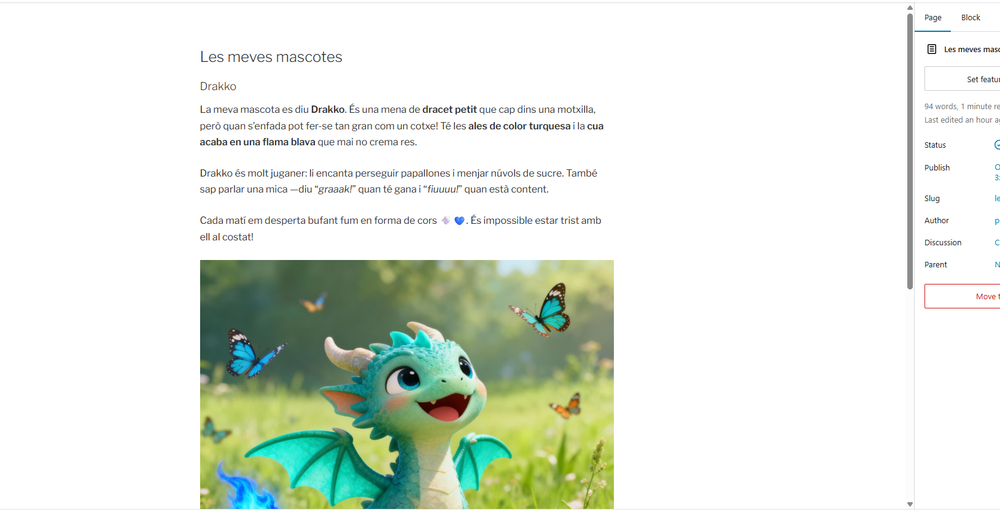

# Tasca 11 Instal·lació de WordPress amb WP Local

## Pagina web: Pol Valles
 

---

| Característica         | Pàgines                             | Entrades                                       |
| ---------------------- | ----------------------------------- | ---------------------------------------------- |
| Contingut              | Contingut fix, estable              | Publicacions dinàmiques del blog               |
| Data                   | No té data visible                  | Té data de publicació                          |
| Categories i etiquetes | Normalment no s’usen                | Sí, es poden assignar                          |
| Ordenació              | No cronològica                      | Ordre cronològic invers (la més recent primer) |
| Exemple                | Inici, Contacte, Les meves mascotes | Opinió sobre una sèrie – Capítol 1, Capítol 2… |
